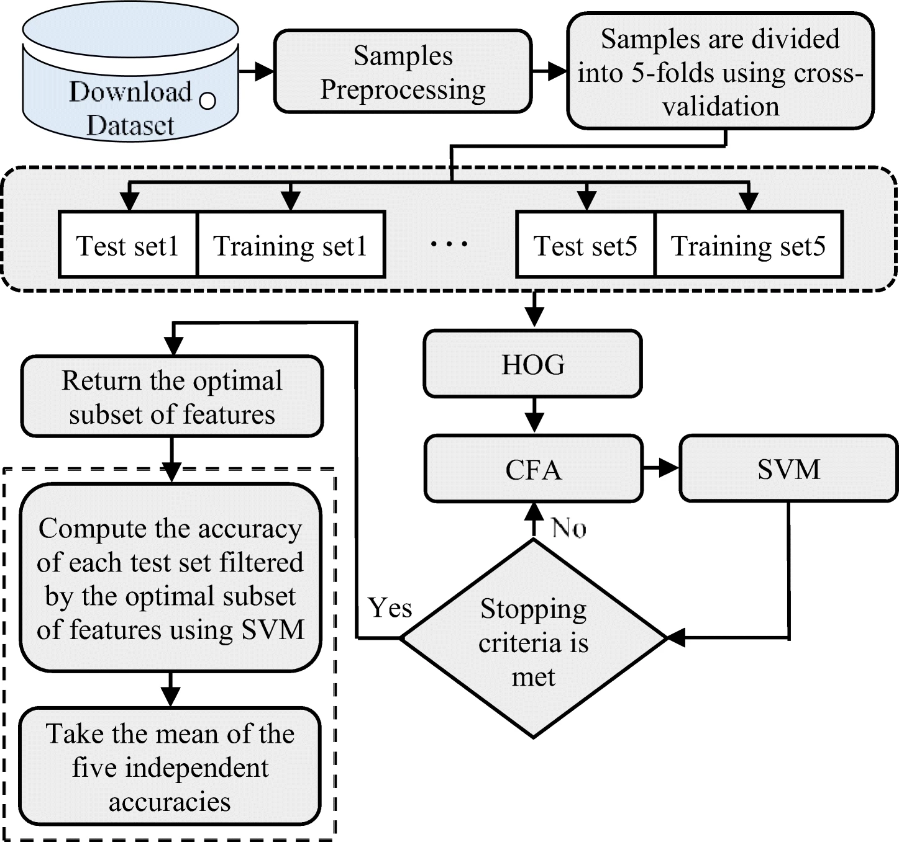

# CS5680 Final Project Proposal
#### Paper: Person-independent facial expression recognition based on the fusion of HOG descriptor and cuttlefish algorithm

 Authors: Haval I. Hussein, Hivi Ismat Dino,  Ramadhan J. Mstafa and Masoud 
 Muhammed Hassan 

 Publication Source: Multimedia Tools and Applications

 Published: 18 February 2022
 
 Source URL: https://link.springer.com/article/10.1007/s11042-022-12438-6

#### Problem I will be Investigating
The main problem that this paper attempts to solve is reducing the dimensionality of the features and extracting the most important features before they are put through a learning algorithm to classify facial expression. Reducing the feature dimensionality helps make the classification more efficient requiring less computation to classify. 

I find this problem to be interesting because of the cool cuttlefish algorithm to reduce the dimensionality of the features and get better performance from the classifiers. I have never heard of that algorithm before and its cool it is inspired by nature. 
I am also interested in using the facial expression recognition in a future project where I use the facial expression recognition as a reward function for a reinforcement learning agent. This paper will help me make a possible reward function for the agent. 

#### Dataset
In the paper they use the CK+ dataset, RaFD dataset, and the JAFFE dataset. All are public datasets. I am planning on using the same datasets for my project. One of the links to the datasets seemed to be broken so If they aren't available any more or I can't find links to them, I will use VISUM facial expression dataset on Kaggle https://www.kaggle.com/c/visum-facial-expression-analysis .

#### Diagram

image from the paper https://link.springer.com/article/10.1007/s11042-022-12438-6

The first block in the diagram is downloading the dataset and loading into the program. The input will be the file path and output will be the dataset loaded into the program as a list of images.

The second block is preprocessing the samples which involves converting the images to grayscale images, cropping the face using the Viola-Jones algorithm, and resizing the image to 64x64 pixels. The input will be the list of images and the output will be the list of preprocessed images in the size of 64x64.

Then third block separates the images into 5 folds using cross validation. Input and output of this block will be 5 sets that will be used for training and validating. 

Then the fourth block runs feature extraction using Histograms of Oriented Gradients (HOG). Input and output of this block will be a training the preprocessed images and output will be the features extracted from the images. 

The fifth block runs the cuttlefish algorithm on the features to reduce the dimensionality of the features. Input and output of this block will be the features extracted from the previous block and the output will be the reduced features. 

Then the sixth block passes the reduced features through the linear support vector machine classifier. Input and output of this block will be the reduced features and the output will be the predicted labels. 

Then evaluating the results. Input and output of this block will be the predicted labels and the output will be the accuracy of the classifier.
Then evaluating the results.

#### Advantages and contributions of the approach from the paper
The paper claims that the cuttlefish algorithm can reduce the dimensionality of the features and improve the performance of the classifier. It can reduce the amount of computation needed to classify the images. 

#### Future work

The authors mention that they would like to try using the cuttlefish algorithm on different ways of extracting features from the images. They also mention that they would like to try using the cuttlefish algorithm on different classifiers.

#### How did the Authors Evaluate their work

The authors evaluated their work by comparing the accuracy of their approach to other approaches. They compared it to the following methods: DWT_HOG+SVM, HOG+three-stageSVM, RawFeature_CNNs+SVM,  sLSP_LB + SVM,
HOG_PCA + DSAE, Li et. al. , LBP_LPQ_WLD_DCT_ DBN + SMO, HOG_GSP + KNN,  DDMTL and CNN_MO-HOG+three-SVM on all three datasets. 

#### How do I plan to improve or modify the proposed approach 

I plan to improve the proposed approach by trying to use a convolution neural network for the classifier and maybe if I have time implement the other classifiers such as K-Nearest Neighbors . I also plan on applying the Laplacian image enhancement on the image before it is trained on the classifier and in the inference of the image as well to see if more preprocessing can improve the algorithm as well. 
I plan to use python to implement the algorithm and pytorch to implement the convolution neural network. 
I also plan to use sklearn to implement the other classifiers if I have time.

#### How will I evaluate my results

I plan to evaluate my results by comparing the accuracy of my approach to the accuracy of the approach of the paper. If I have time I would like to evaluate the accuracy of my approach to the accuracy of other approaches as well.

### Schedule

| Week | Goal |
| --- | --- |
| Week 1: Nov. 19, Sunday – Nov. 25, Saturday | Implement the algorithm in the paper in python and run on datasets  |
| Week 2: Nov. 26, Sunday – Dec. 2, Saturday |  Implement changes to improve the algorithm and test improvements  |
| Week 3: Dec. 3, Sunday – Dec. 11, Monday | Evaluate improvements and analyze results  |

